# conflict

# 상황
1. src/main/java/com/team12/Main.java 파일에 나와 A 두 사람이 작업 후 각각 PR을 올렸습니다.
   1. 나는 나 브랜치를 만들고 Add List 라는 메세지로 커밋 후 PR을 올렸습니다.
   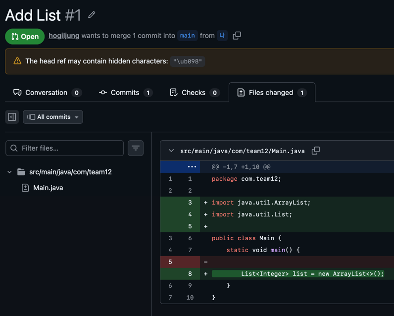
   2. A는 A 브랜치를 만들고 Add Map이라는 메세지로 커밋 후 PR을 올렸습니다.
   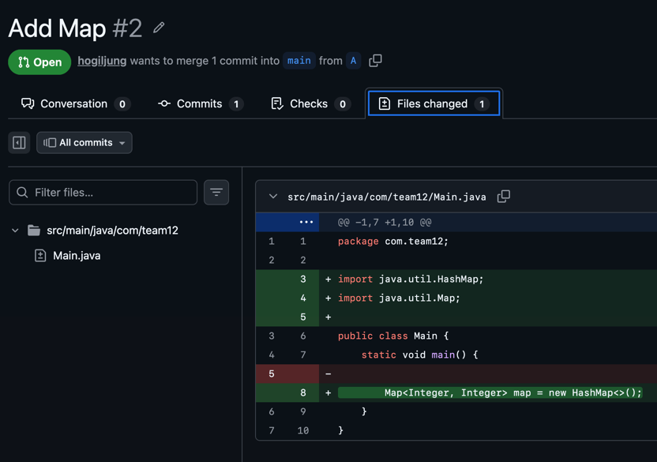
2. A의 PR이 먼저 반영되어 나의 PR이 충돌이 생겼습니다.
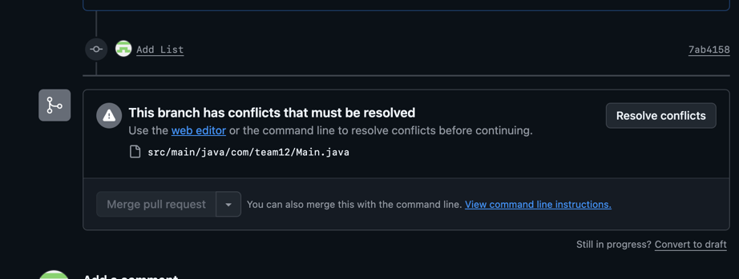
3. 나에게 충돌을 수정해달라는 요청이 왔습니다.

# 해결
## merge 이용
1. main 브랜치의 수정을 pull 하기 위해 main 브랜치로 checkout 합니다.
```bash
git checkout main
```
2. main 브랜치를 pull 합니다.
```bash
git pull origin main
```
3. 다시 나 브랜치로 checkout합니다.
```bash
git checkout 나
```
4. main 브랜치로 merge 합니다.
```bash
git merge main
```
5. 충돌을 확인하였습니다.

   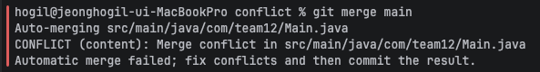
   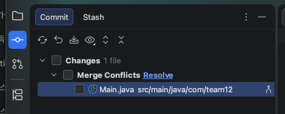
6. 해당 파일을 클릭하여 수정을 위한 Merge 창을 엽니다.
   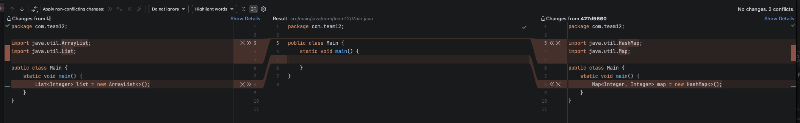
- 왼쪽은 나의 변경 내역입니다.
- 오른쪽은 main 브랜치입니다.
- 가운데에서 충돌을 해결합니다.
7. main의 변경 아래에 나의 변경을 추가하려 합니다.
   1. 오른쪽에서 << 를 클릭해 가운데에 반영합니다.
   2. 왼쪽에서 >> 를 클릭해 가운데에 반영합니다.
      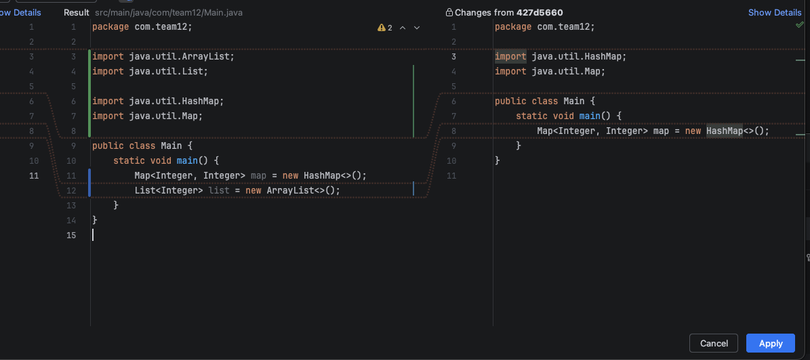
   3. 가운데에서 빨간색 표시가 사라지고 정상적으로 합쳐졌다면 apply를 누릅니다.
   4. 충돌이 해결된 걸 확인할 수 있습니다.
      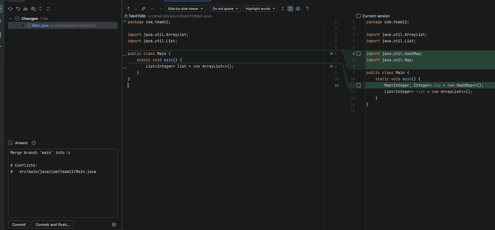
   5. 수정된 파일 체크박스를 체크하고 commit을 합니다.
      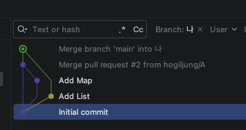
   6. 해당 commit을 push 합니다.
   ```bash
   git push origin 나
   ```
   7. 충돌이 해결된 걸 확인할 수 있습니다.
   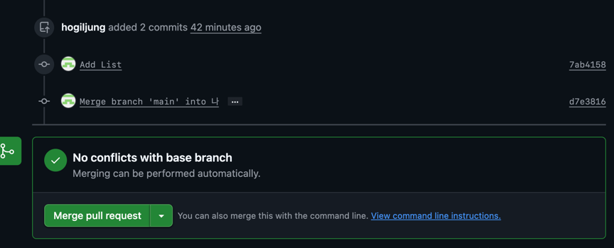

## rebase로 충돌해결
> force push가 필요하기 때문에 주의가 필요합니다.

1. merge와 동일하게 main의 최신 commit을 가져옵니다.
2. 다시 나 브랜치로 checkout 합니다.
3. rebase를 시도합니다.
```bash
git rebase main
```
4. 수정 후 stage에 올립니다.
```bash
git add Main.java
```
5. rebase를 계속 진행합니다.
```bash
git rebase --continue
```
커밋이 3개라면 이 stage에 올리고 rebase를 continue 하는 과정을 3번 반복할 수 있습니다.

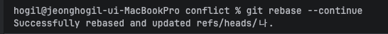

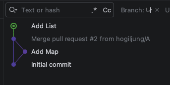

6. git rebase로 인해 원격 저장소에 있는 브랜치와 로컬 브랜치가 달라졌기 때문에 일반적인 push가 안됩니다.
강제 푸시가 필요합니다.
```bash
git push origin 나 --force
```
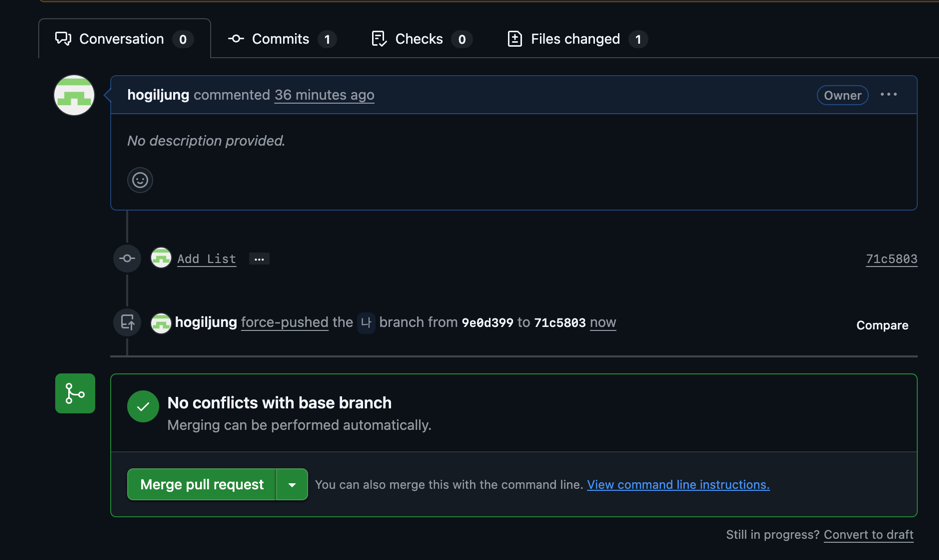
7. force push 후 충돌이 해결된 걸 확인할 수 있습니다.

## 예외사항
### import가 중복되어 되어있을 때
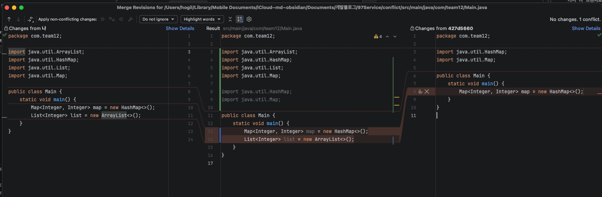

apply 후 import를 정리합니다.

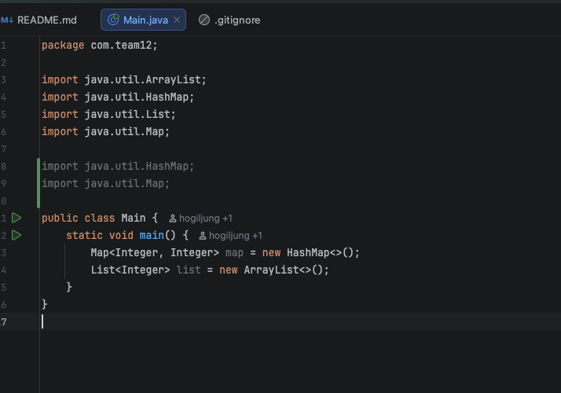

`ctrl`+`option`+`O` 를 누르면 자동으로 정리됩니다.
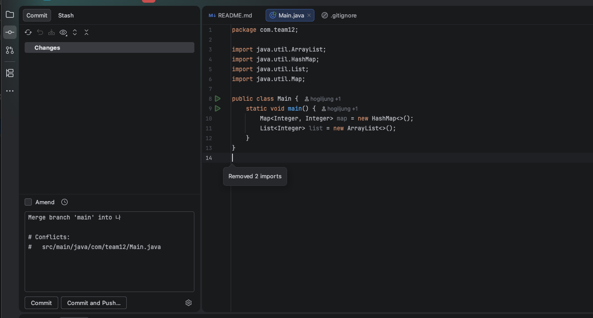

변경된 파일을 stage에 올리고 commit을 통해 merge를 완료합니다.
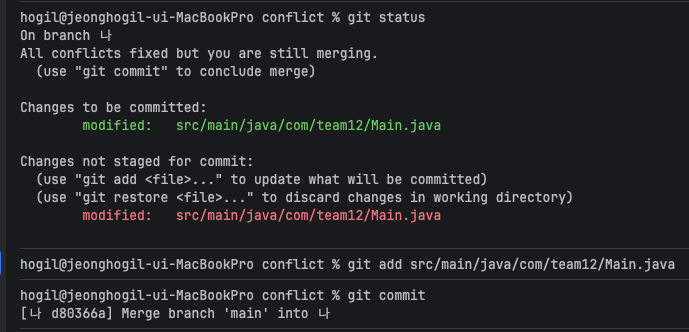
